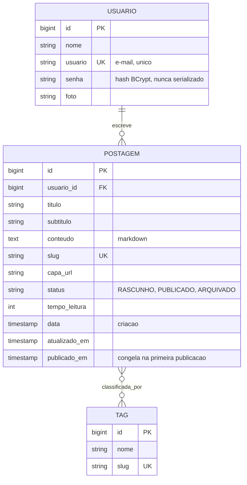

# Blog Pessoal API

API REST de uma plataforma de publicação de artigos, em Java 21 e Spring Boot 3.5.
Autenticação JWT, autorização por dono do recurso, schema versionado com Flyway
e 20 testes de integração.


## Sobre

Este projeto nasceu como exercício do Bootcamp Full Stack Java da
[Generation Brasil](https://www.generation.org/brasil/): um CRUD de postagens
com temas e usuários.

Voltei a ele meses depois e encontrei problemas que um exercício não cobre.
O mais sério: **qualquer pessoa autenticada podia editar ou apagar a postagem de
qualquer outra**, porque o controller conferia se o id existia mas não conferia
se quem pedia a alteração era a autora.

O repositório documenta a evolução desse CRUD até uma plataforma de publicação
no formato do Medium, com markdown, rascunhos, slug e tags. Cada decisão está
registrada em [MIGRACAO-FASE-1.md](MIGRACAO-FASE-1.md) e [FASE-2.md](FASE-2.md).

## Modelo de dados



## Segurança

Três correções que mudaram o comportamento da API, cada uma com teste cobrindo.

**Autorização por dono do recurso.** Editar, excluir ou publicar exige ser o
autor. Verificar apenas se o recurso existe deixa qualquer usuário autenticado
alterar conteúdo alheio. Autenticado não é a mesma coisa que autorizado.

**Entidade nunca vira resposta.** `GET /usuarios` devolvia a entidade JPA
completa, com o hash da senha. Com DTOs, o objeto de resposta não tem onde
guardar uma senha. O caminho inverso também fecha: o cliente não define o autor
de uma postagem mandando um id no corpo, porque esse campo não existe no request.

**Segredo do JWT fora do código.** A chave de assinatura estava escrita no
código e versionada, o que permitia forjar token de qualquer usuário a quem
tivesse acesso ao repositório. Hoje vem de variável de ambiente, validada no
boot: sem `JWT_SECRET` a aplicação não sobe.

Detalhe adicional: rascunho de terceiro responde **404**, não 403. Um 403
confirmaria que o recurso existe, e daria para varrer ids e mapear quantos
rascunhos alguém tem.

## Decisões de engenharia

**Flyway em vez de `ddl-auto=update`.** Schema versionado em SQL, com histórico
e ordem garantida. O `update` funciona até a primeira mudança que o Hibernate
não sabe aplicar sozinho.

**Expand and contract na migração do modelo.** As colunas antigas continuam no
banco aceitando null, e a aplicação nova ainda escreve nelas mesmo sem lê-las.
Se o deploy falhar, dá para voltar a versão anterior e ela funciona, inclusive
com o conteúdo criado depois da migração. A remoção fica para uma migration
posterior, quando o front tiver migrado.

**Mesmo banco em dev e produção.** PostgreSQL nos dois, via Docker localmente.
Diferença de dialeto entre ambientes é bug que só aparece no deploy.

**Toda postagem nasce rascunho.** O status não está no corpo de criação nem de
atualização: muda por endpoints próprios. Isso evita despublicar um artigo sem
querer ao salvar uma correção de vírgula.

**Slug e data de publicação congelam.** Enquanto é rascunho, o slug acompanha o
título. Depois de publicado não muda mais, porque o link já circulou.

**O feed não carrega o markdown.** `PostagemResumoResponse` não tem o campo
`conteudo`. Um artigo pode ter 50 mil caracteres, e devolver isso para cada item
de uma listagem seriam megabytes de JSON que a tela do feed não usa.

**`LEFT JOIN FETCH` para o autor, `@BatchSize` para as tags.** Sem o join, uma
página de 10 postagens dispara 21 consultas. Com join na coleção de tags, o
Hibernate traz tudo para a memória e pagina em Java. Cada relação pede uma
estratégia diferente.

## Endpoints

| Método | Rota | Auth |
|---|---|---|
| `POST` | `/usuarios/cadastrar` | pública |
| `POST` | `/usuarios/logar` | pública |
| `GET` | `/usuarios/me` | token |
| `PUT` | `/usuarios/atualizar` | token, próprio perfil |
| `GET` | `/postagens` | pública, feed paginado |
| `GET` | `/postagens/buscar?termo=` | pública |
| `GET` | `/postagens/tag/{slugTag}` | pública |
| `GET` | `/postagens/slug/{slug}` | pública |
| `GET` | `/postagens/minhas?status=` | token, inclui rascunhos |
| `POST` | `/postagens` | token, cria rascunho |
| `PUT` `DELETE` | `/postagens/{id}` | token, só o autor |
| `PATCH` | `/postagens/{id}/publicar` | token, só o autor |
| `PATCH` | `/postagens/{id}/arquivar` | token, só o autor |
| `PATCH` | `/postagens/{id}/rascunho` | token, só o autor |
| `GET` | `/tags`, `/tags/buscar?nome=`, `/tags/{slug}` | pública |

Documentação completa e interativa no Swagger, em `/swagger-ui/index.html`.

## Tecnologias

Java 21 · Spring Boot 3.5 · Spring Security · JWT (jjwt) · Spring Data JPA ·
Hibernate 6 · Flyway · PostgreSQL 16 · H2 · JUnit 5 · springdoc-openapi ·
Maven · Docker

## Rodando localmente

Requer Java 21 e Docker.

```bash
git clone https://github.com/bruna-dsmendes/blog-pessoal.git
cd blog-pessoal

docker compose up -d                                  # sobe o PostgreSQL
SPRING_PROFILES_ACTIVE=dev ./mvnw spring-boot:run     # sobe a API
```

A API responde em `http://localhost:8080` e o Flyway aplica as migrations no
primeiro boot.

```bash
./mvnw test
```

## Variáveis de ambiente

| Variável | Obrigatória | Descrição |
|---|---|---|
| `JWT_SECRET` | em produção | Chave Base64 de no mínimo 32 bytes |
| `JWT_EXPIRATION_MINUTES` | não | Validade do token, padrão 60 |
| `CORS_ALLOWED_ORIGINS` | não | Origens permitidas, separadas por vírgula |
| `POSTGRESHOST` `POSTGRESPORT` `POSTGRESDATABASE` `POSTGRESUSER` `POSTGRESPASSWORD` | em produção | Conexão com o banco |

No perfil `dev` existe um valor padrão de desenvolvimento. Em produção não:
sem `JWT_SECRET`, a aplicação falha no boot em vez de subir com uma chave
conhecida.

```bash
openssl rand -base64 48    # gera um secret
```

## Estrutura

```
src/main/java/com/generation/blogpessoal
├── controller     # entrada HTTP, sem regra de negócio
├── dto            # contratos de request e response, por domínio
├── exception      # exceções de domínio e handler global
├── model          # entidades JPA
├── repository     # Spring Data e consultas com JOIN FETCH
├── security       # JWT, filtro, CORS e configuração do Spring Security
└── service        # regras de negócio, autoria e ciclo de publicação

src/main/resources/db/migration    # migrations Flyway, V1 a V4
```

## Roadmap

- [x] **Fase 1** — DTOs, autorização por autor, paginação, Flyway, tratamento de erros
- [x] **Fase 2** — Markdown, slug, rascunho e publicação, tags N:N
- [ ] **Fase 3** — Upload de imagens, embed de vídeo, sanitização do markdown
- [ ] **Fase 4** — Comentários e reações
- [ ] **Contração** — V5 remove `texto`, `tema_id` e `tb_temas`

---

Desenvolvido por [Bruna Mendes](https://github.com/bruna-dsmendes).
