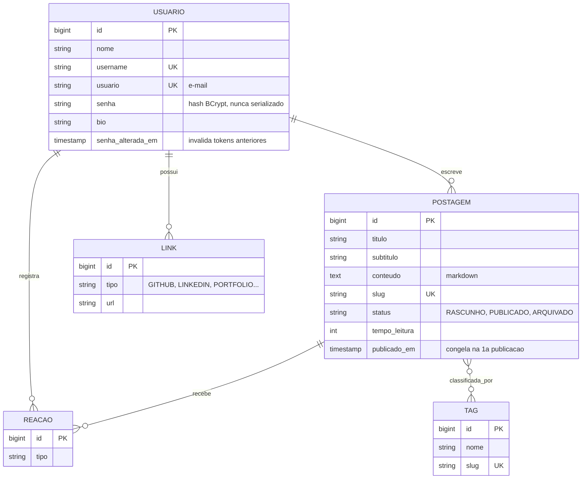

# Simetria.Dev API

API REST de uma plataforma de publicação de artigos, em Java 21 e Spring Boot 3.5.
Sessão em cookie `httpOnly`, autorização por dono do recurso, schema versionado
com Flyway e 40 testes de integração.


**Site:** [simetriadev.vercel.app](https://simetriadev.vercel.app) ·
**Front-end:** [bruna-dsmendes/Blog_pessoal_react](https://github.com/bruna-dsmendes/Blog_pessoal_react)

## Sobre

Este projeto nasceu como exercício do Bootcamp Full Stack Java da
[Generation Brasil](https://www.generation.org/brasil/): um CRUD de postagens
com temas e usuários.

Voltei a ele meses depois e encontrei problemas que um exercício não cobre.
O mais sério: **qualquer pessoa autenticada podia editar ou apagar a postagem de
qualquer outra**, porque o controller conferia se o id existia mas não conferia
se quem pedia a alteração era a autora.

O repositório documenta a evolução desse CRUD até uma plataforma de publicação,
com o modelo de dados migrado em produção sem downtime. Cada etapa está
registrada em [MIGRACAO-FASE-1.md](MIGRACAO-FASE-1.md), [FASE-2.md](FASE-2.md),
[COOKIE-HTTPONLY.md](COOKIE-HTTPONLY.md), [PERFIL-PUBLICO.md](PERFIL-PUBLICO.md),
[REACOES.md](REACOES.md) e [REDEFINICAO-DE-SENHA.md](REDEFINICAO-DE-SENHA.md).

## Modelo de dados



## Segurança

Cada item abaixo tem teste cobrindo.

**Autorização por dono do recurso.** Editar, excluir ou publicar exige ser o
autor. Verificar apenas se o recurso existe deixa qualquer usuário autenticado
alterar conteúdo alheio. Autenticado não é a mesma coisa que autorizado.

**Sessão em cookie `httpOnly`.** O JavaScript da página não consegue ler o
token, então um XSS não leva a sessão embora. Como o navegador passa a anexar a
credencial sozinho, `SameSite=Lax` cobre o CSRF que essa mudança traz junto.

**Trocar a senha derruba as sessões abertas.** JWT é sem estado, então mudar a
senha não invalidaria nada por si só, e quem invadiu a conta seguiria logado. A
coluna `senha_alterada_em` resolve: o filtro descarta token emitido antes dela.

**Entidade nunca vira resposta.** `GET /usuarios` devolvia a entidade JPA
completa, com o hash da senha. Com DTOs, o objeto de resposta não tem onde
guardar uma senha, e o cliente não define o autor de uma postagem mandando um id
no corpo.

**Segredo do JWT fora do código.** A chave estava escrita e versionada, o que
permitia forjar token de qualquer usuário a quem tivesse acesso ao repositório.
Hoje vem de variável de ambiente, validada no boot.

**Rascunho de terceiro responde 404, não 403.** Um 403 confirmaria que o recurso
existe, e daria para varrer ids e mapear quantos rascunhos alguém tem.

## Decisões de engenharia

**Flyway em vez de `ddl-auto=update`.** Schema versionado em SQL, com histórico
e ordem garantida. O `update` funciona até a primeira mudança que o Hibernate não
sabe aplicar sozinho.

**Expand and contract na migração do modelo.** Trocar tema por tags e `texto` por
markdown aconteceu com dados em produção. As colunas antigas continuam no banco
aceitando null, e a aplicação ainda escreve nelas mesmo sem lê-las, para que
voltar a versão anterior continue funcionando. A remoção fica para depois que o
front estiver migrado há algum tempo.

**Mesmo banco em dev e produção.** PostgreSQL nos dois, via Docker localmente.
Diferença de dialeto entre ambientes é bug que só aparece no deploy.

**Toda postagem nasce rascunho.** O status não está no corpo de criação nem de
atualização: muda por endpoints próprios, o que evita despublicar um artigo sem
querer ao salvar uma correção de vírgula.

**Slug e data de publicação congelam.** Enquanto é rascunho, o slug acompanha o
título. Depois de publicado não muda mais, porque o link já circulou.

**Uma reação por pessoa, garantida por constraint.** O número diz quantas
pessoas gostaram, e não quantos cliques houve. Verificar antes de inserir
resolve o caso comum, mas dois cliques simultâneos passam juntos: a constraint
única barra o segundo, e o service trata a exceção como sucesso, porque o estado
final é o esperado.

**`LEFT JOIN FETCH` para o autor, `@BatchSize` para as coleções.** Sem o join,
uma página de 10 postagens dispara 21 consultas. Com join na coleção de tags, o
Hibernate traz tudo para a memória e pagina em Java. Cada relação pede uma
estratégia diferente.

**E-mail por API HTTP, não SMTP.** A hospedagem bloqueia saída nas portas SMTP
como medida antispam, e o envio estourava `Connection timed out` só em produção.
A API usa 443 e passa.

## LGPD

Os direitos do titular são atendidos pela própria aplicação, não por e-mail:

- `GET /usuarios/me/dados` exporta cadastro, artigos e rascunhos (art. 18, V)
- `POST /usuarios/excluir-conta` elimina a conta (art. 18, VI), pedindo a senha
  de novo porque o cookie sozinho não deveria bastar para uma ação irreversível

Na exclusão, quem sai escolhe entre **anonimizar** os artigos, mantendo os links
que já circularam, ou **apagar tudo**. A anonimização se apoia no art. 12 e usa o
autor nulo, caso que o código já tratava desde a primeira refatoração.

## Endpoints

| Método | Rota | Acesso |
|---|---|---|
| `POST` | `/usuarios/cadastrar`, `/usuarios/logar`, `/usuarios/deslogar` | pública |
| `POST` | `/usuarios/esqueci-a-senha`, `/usuarios/redefinir-senha` | pública |
| `GET` | `/usuarios/perfil/{username}` | pública |
| `GET` | `/usuarios/me`, `/usuarios/me/dados` | sessão |
| `PUT` | `/usuarios/atualizar` | sessão, próprio perfil |
| `POST` | `/usuarios/excluir-conta` | sessão |
| `GET` | `/postagens`, `/postagens/slug/{slug}`, `/postagens/{id}` | pública |
| `GET` | `/postagens/buscar`, `/postagens/tag/{slug}`, `/postagens/autor/{username}` | pública |
| `GET` | `/postagens/minhas` | sessão, inclui rascunhos |
| `POST` `PUT` `DELETE` | `/postagens`, `/postagens/{id}` | sessão, só o autor |
| `PATCH` | `/postagens/{id}/publicar`, `/arquivar`, `/rascunho` | sessão, só o autor |
| `POST` `DELETE` | `/postagens/{id}/reagir` | sessão |
| `GET` | `/tags`, `/estatisticas` | pública |

Documentação interativa no Swagger, em `/swagger-ui/index.html`.

## Tecnologias

Java 21 · Spring Boot 3.5 · Spring Security · JWT (jjwt) · Spring Data JPA ·
Hibernate 6 · Flyway · PostgreSQL 16 · H2 · JUnit 5 · springdoc-openapi ·
Maven · Docker

## Rodando localmente

Requer Java 21 e Docker.

```bash
git clone https://github.com/bruna-dsmendes/blog-pessoal.git
cd blog-pessoal

docker compose up -d                                  # sobe o PostgreSQL
SPRING_PROFILES_ACTIVE=dev ./mvnw spring-boot:run     # sobe a API
```

A API responde em `http://localhost:8080` e o Flyway aplica as migrations no
primeiro boot.

```bash
./mvnw test
```

Para exercitar o envio de e-mail localmente, acrescente `MAIL_ENABLED=true` e
`MAIL_API_KEY` ao comando. Sem isso o envio fica desligado e o assunto vai para
o log, que é como os testes rodam.

## Variáveis de ambiente

| Variável | Obrigatória | Descrição |
|---|---|---|
| `JWT_SECRET` | em produção | Chave Base64 de no mínimo 32 bytes |
| `JWT_EXPIRATION_MINUTES` | não | Validade do token, padrão 60 |
| `COOKIE_SECURE` | não | Exige HTTPS, padrão `true`. O perfil `dev` desliga |
| `COOKIE_SAME_SITE` | não | Padrão `Lax` |
| `FRONTEND_URL` | em produção | Monta o link do e-mail de redefinição |
| `MAIL_ENABLED`, `MAIL_API_KEY`, `MAIL_FROM` | para enviar e-mail | Envio transacional |
| `POSTGRESHOST` `POSTGRESPORT` `POSTGRESDATABASE` `POSTGRESUSER` `POSTGRESPASSWORD` | em produção | Conexão com o banco |

```bash
openssl rand -base64 48    # gera um secret
```

## Estrutura

```
src/main/java/com/generation/blogpessoal
├── controller     # entrada HTTP, sem regra de negócio
├── dto            # contratos de request e response, por domínio
├── exception      # exceções de domínio e handler global
├── model          # entidades JPA
├── repository     # Spring Data e consultas com JOIN FETCH
├── security       # JWT, cookie, filtro, CORS e Spring Security
└── service        # regras de negócio, autoria e ciclo de publicação

src/main/resources/db/migration    # migrations Flyway, V1 a V8
```

## Roadmap

- [x] DTOs, autorização por autor, paginação, Flyway, tratamento de erros
- [x] Markdown, slug, rascunho e publicação, tags N:N
- [x] Sessão em cookie httpOnly com invalidação ao trocar a senha
- [x] Perfil público de autor, links e estatísticas da plataforma
- [x] Reações
- [x] Exportação de dados e exclusão de conta (LGPD)
- [x] Redefinição de senha por e-mail
- [ ] Sanitização do markdown com CommonMark e Jsoup
- [ ] Limite de tentativas no login e no pedido de redefinição
- [ ] Comentários
- [ ] Contração: remover `texto`, `tema_id` e `tb_temas`

---

Desenvolvido por [Bruna Mendes](https://github.com/bruna-dsmendes).